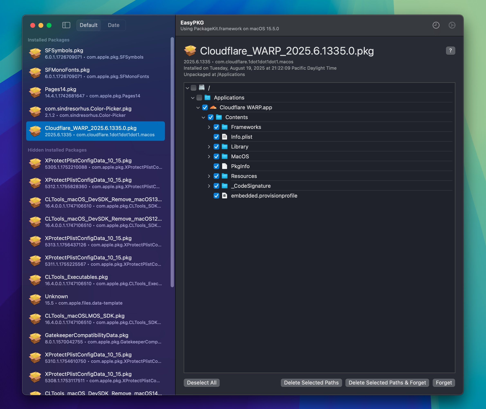

# EasyPKG

|  |
| :---------------------: |

macOS Application that dives into Apple's PackageKit.framework private framework, this lists installed packages (.pkg) from specified volumes and lists your package overall history.

## Download

> [!WARNING]
> Some of the actions in this app can also be considered dangerous, only delete whats neccessary, and not entire drives, you've been warned.

Visit [releases](https://github.com/khcrysalis/EasyPKG/releases) and get the latest `.dmg`.

## Limitations
Due to how the package files work, there's no way for you to properly uninstall these packages. Presumably you're not supposed to manage these packages and they're supposed to be a one-time-install thing that you don't bat an eye about. 

This design decision comes at some consenquences, where if you're trying to clear space you wouldn't know what PKG files you've installed nor know where the files would be placed, which is the point of this app. However, as said previously PKG files are only meant for installing, not uninstalling-so there's no way to properly uninstall these packages without doing everything manually. Conveniently, `PackageKit.framework` has some functionality to find where these installed files would be located, along with the ability to forget these packages even existed on your Mac in the first place, we can still clear any remnants with this info but again it's not going to be all of it.

### Installed Packages

Certain packages like Rosetta will only be deletable via Recovery, you can still 'forget' about the package, but obviously you shouldn't be doing that first before deleting the contents in Recovery. These packages in particular are hidden by default and should not be messed with:

| Hidden by Default                           | Description
| :------------------------------------------ | :-------------------------------------------------------------------------------------------------- |
| `com.apple.files.data-template`             | File template                                                                                       |
| `com.apple.pkg.RosettaUpdateAuto`           | Rosetta (needs special care)                                                                        |
| `com.apple.pkg.XProtectPlistConfigData`     | GateKeeper                                                                                          |
| `com.apple.pkg.XProtectPayloads`            | GateKeeper                                                                                          |
| `com.apple.pkg.MRTConfigData`               | GateKeeper                                                                                          |
| `com.apple.pkg.GatekeeperCompatibilityData` | GateKeeper                                                                                          |
| `com.apple.pkg.CLTools`                     | CommandLineTools                                                                                    |
| `com.apple.pkg.XcodeSystemResources`        | Xcode Resources, mainly for Simulator                                                               |
| `com.apple.pkg.MobileDeviceDevelopment`     | [Mobile Packet Tracing](https://developer.apple.com/documentation/network/recording-a-packet-trace) |

## Sponsors

| Thanks to all my [sponsors](https://github.com/sponsors/khcrysalis)!! |
|:-:|
|  |
| _**"samara is cute" - Vendicated**_ |

## License

Project is licensed under the MIT license. You can see the full details of the license [here](https://github.com/khcrysalis/Copyboard/blob/main/LICENSE).
