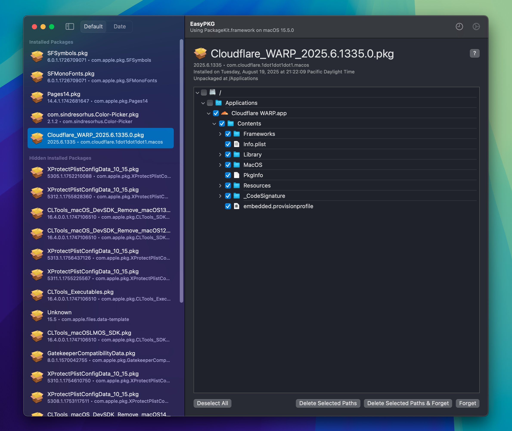

# EasyPKG

|  |
| :---------------------: |

macOS Application that dives into Apple's PackageKit.framework private framework, this lists installed packages (.pkg) from specified volumes and lists your package overall history.

## Download

Visit [releases](https://github.com/khcrysalis/EasyPKG/releases) and get the latest `.zip`.

## License

Project is licensed under the MIT license. You can see the full details of the license [here](https://github.com/khcrysalis/Copyboard/blob/main/LICENSE).
